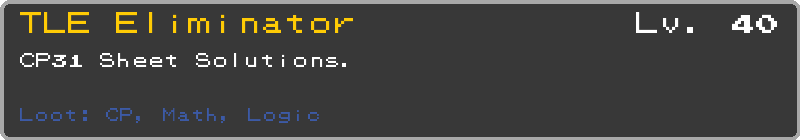
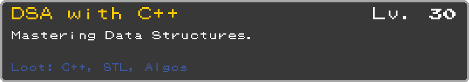
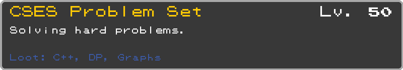
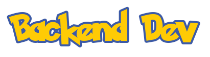
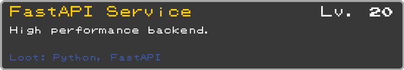
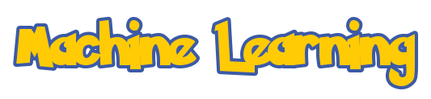
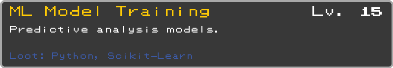
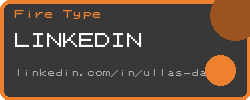
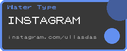

  
  <h1>⚡ Hey! I'm Ullas, Here to Code My Own Adventure ⚡</h1>

### 

<table width="100%" align="center">
  <tr>
    <td width="60%">
      <h3></h3>
      <ul>
        <li><b>Name</b>: Ullas Das</li>
        <li><b>Class</b>: Computer Science Student</li>
        <li><b>Region</b>: NIT Durgapur</li>
        <li><b>Type</b>: <code>Coder</code> / <code>Problem Solver</code></li>
        <li><b>Nature</b>: <b>Hardy</b> (Never gives up!)</li>
        <li><b>Buddy</b>: Charizard 🔥</li>
      </ul>
       
      
       
       
       
       
       
      <i>(Click'em to see detailed league stats)</i>
    </td>
    <td width="40%" align="center" valign="center">
      
       
      <i>"Gotta Solve 'Em All!"</i>
    </td>
  </tr>
</table>

---

<table width="100%" align="center">
  <tr>
    <td width="50%" valign="top">
      

        
      

      <table border="0">
        <tr>
          <td width="45"></td>
          <td><b>Boulder Badge</b>: Strong fundamentals in C, C++, Python</td>
        </tr>
        <tr>
          <td width="45"></td>
          <td><b>Cascade Badge</b>: Fluency in coding with Data Structures</td>
        </tr>
        <tr>
          <td width="45"></td>
          <td><b>Thunder Badge</b>: Speed in Competitive Programming</td>
        </tr>
        <tr>
          <td width="45"></td>
          <td><b>Rainbow Badge</b>: Python libraries and other technologies</td>
        </tr>
        <tr>
          <td width="45"></td>
          <td><b>Soul Badge</b>: Love for Math and CP</td>
        </tr>
        <tr>
          <td width="45"></td>
          <td><b>Marsh Badge</b>: Problem Solving</td>
        </tr>
        <tr>
          <td width="45"></td>
          <td><b>Volcano Badge</b>: Burning passion for success</td>
        </tr>
        <tr>
          <td width="45"></td>
          <td><b>Earth Badge</b>: Always ready to learn new things</td>
        </tr>
      </table>
    </td>
    <td width="50%" valign="top">
      

        
      

      

        <h4 align="center">Languages</h4>
        
          
        <h4 align="center">Technologies & Frameworks</h4>
        
         
        
        
      

    </td>
  </tr>
</table>

---

  

<!-- DSA & CP -->

  
   
   
   
  

 

<!-- Backend -->

  
   
  

 

<!-- ML -->

  
   
  

 

  <i>(Select a quest to warp to repository)</i>

---

### 

<table align="center" width="100%">
  <tr>
    <td width="55%" valign="center" align="center">
      
       
      
    </td>
    <td width="45%" valign="center" align="center">
      
    </td>
  </tr>
</table>

---

### 

<table align="center" width="100%">
  <tr>
    <td width="50%" valign="top">
      

        
      

      <blockquote>
      <ul>
        <li><b>Aug 26, 2024</b>: Started my adventure! College began, and I took <code>C</code> as my starter.</li>
        <li><b>Dec 01, 2024</b>: Evolved my skills! Entered the <b>DSA</b> Gym training with <code>C++</code>.</li>
        <li><b>May 01, 2025</b>: Challengers approaching! Started battling on <b>Codeforces</b> & <b>CodeChef</b>.</li>
        <li><b>June 2025</b>: Gym Leader defeated! Completed the core <b>DSA</b> training.</li>
        <li><b>Nov 2025</b>: The Big Leagues! Participated in my first <b>ICPC</b> prelims.</li>
        <li><b>Dec 2025</b>: Tech Expansion! Started learning <b>FastAPI</b> & Python libraries. Currently building a <b>Social Media API</b>.</li>
      </ul>
      </blockquote>
    </td>
    <td width="50%" valign="top">
      

        
      

      

         
        <i>Current Champion Team:</i> 
        <b>Training in progress...</b>
          
        
        
        
      

    </td>
  </tr>
</table>

---

<table align="center" width="100%">
  <tr>
    <td width="50%" valign="top" align="center">
      <h3></h3>
      

<pre>
> connecting to link_cable...
> connection established!
> status: ready_to_collab
> target: "Software Engineer"
> current_quest: "Backend Dev + CP"
</pre>
      

    </td>
    <td width="50%" valign="top" align="center">
      <h3></h3>
      
<i>Who will you choose?</i>

       
       
      
    </td>
  </tr>
</table>

 

  
   
        <i>Saving Progress...</i> 

