<div align="center">
  
  <h1>⚡ Hey! I'm Ullas, Here to Code My Own Adventure ⚡</h1>
</div>

### 🆔 **TRAINER LEAGUE CARD**
<div align="center">
<table width="100%" align="center">
  <tr>
    <td width="60%">
      <h3>👤 TRAINER INFO</h3>
      <ul>
        <li><b>Name</b>: Ullas Das</li>
        <li><b>Class</b>: Computer Science Student</li>
        <li><b>Region</b>: NIT Durgapur</li>
        <li><b>Type</b>: <code>Coder</code> / <code>Problem Solver</code></li>
        <li><b>Nature</b>: <b>Hardy</b> (Never gives up!)</li>
        <li><b>Buddy</b>: Charizard 🔥</li>
      </ul>
      <br>
      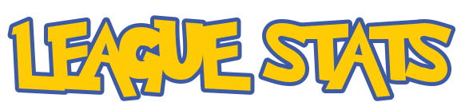
      <br>
      <a href="https://leetcode.com/u/UllasDas004"></a><br>
      <a href="https://leetcode.com/u/UllasDas004">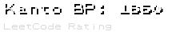</a><br>
      <a href="https://codeforces.com/profile/UllasDas004">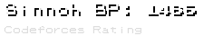</a><br>
      <a href="https://www.codechef.com/users/UllasDas004">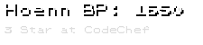</a><br>
      <i>(Click'em to see detailed league stats)</i>
    </td>
    <td width="40%" align="center" valign="center">
      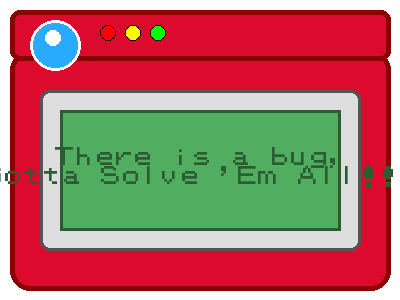
      <br>
      <i>"Gotta Solve 'Em All!"</i>
    </td>
  </tr>
</table>
</div>

---

<div align="center">
<table width="100%" align="center">
  <tr>
    <td width="50%" valign="top">
      <div align="center">
        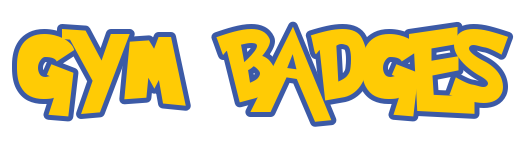
      </div>
      <table border="0">
        <tr>
          <td width="45"></td>
          <td><b>Boulder Badge</b>: Strong fundamentals in C, C++, Python</td>
        </tr>
        <tr>
          <td width="45">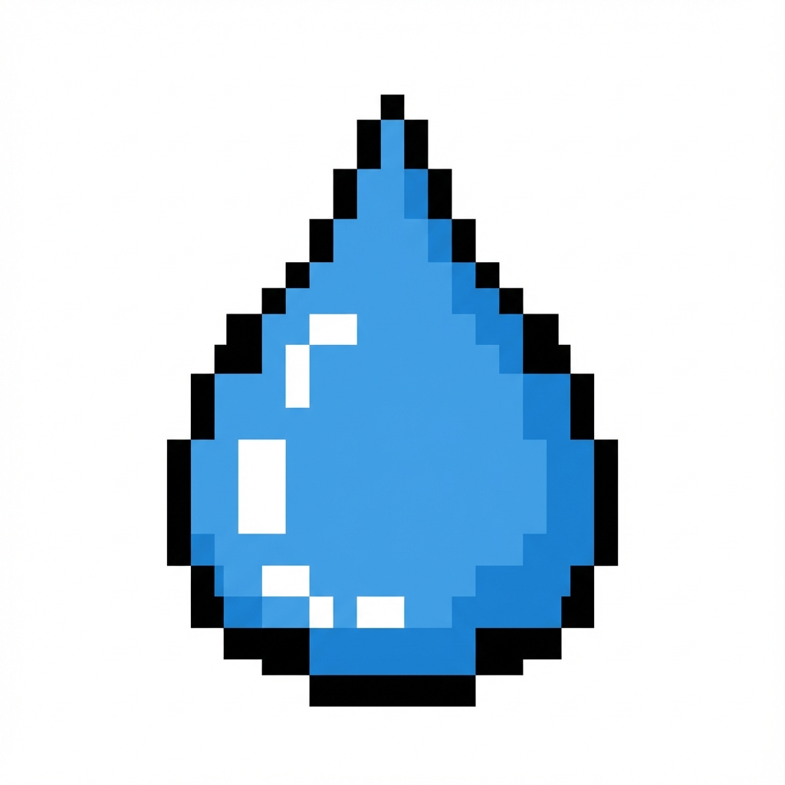</td>
          <td><b>Cascade Badge</b>: Fluency in coding with Data Structures</td>
        </tr>
        <tr>
          <td width="45">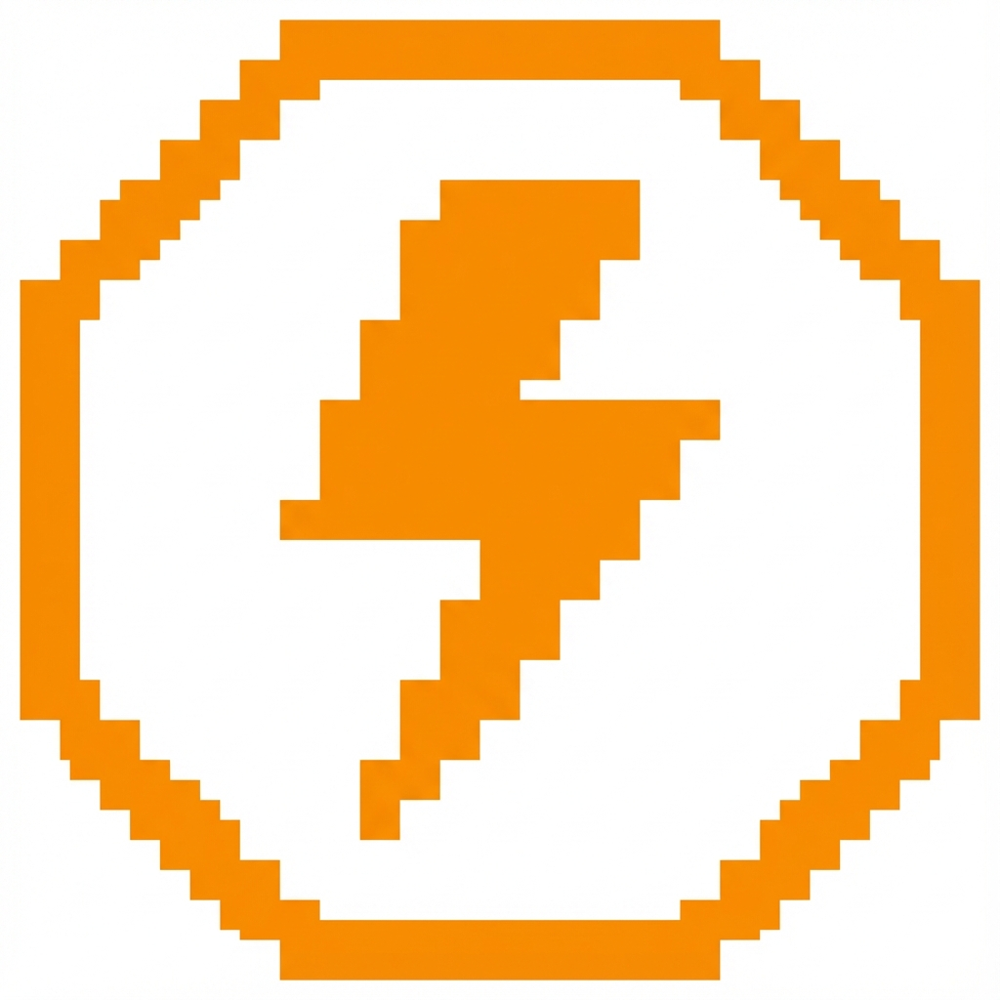</td>
          <td><b>Thunder Badge</b>: Speed in Competitive Programming</td>
        </tr>
        <tr>
          <td width="45">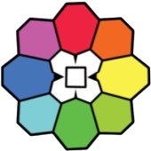</td>
          <td><b>Rainbow Badge</b>: Python libraries and other technologies</td>
        </tr>
        <tr>
          <td width="45"></td>
          <td><b>Soul Badge</b>: Love for Math and CP</td>
        </tr>
        <tr>
          <td width="45">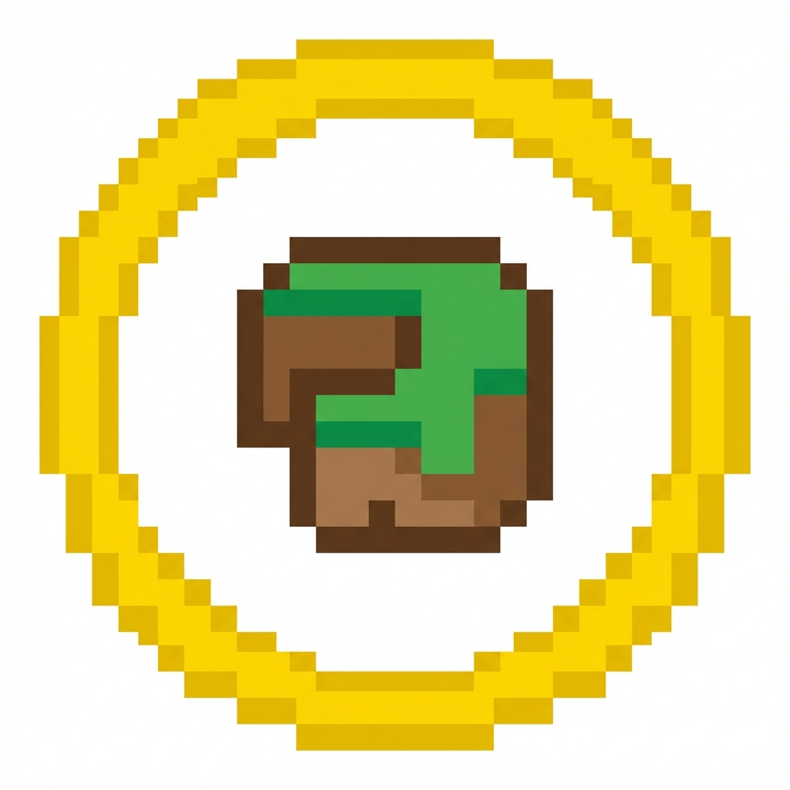</td>
          <td><b>Marsh Badge</b>: Problem Solving</td>
        </tr>
        <tr>
          <td width="45">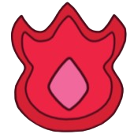</td>
          <td><b>Volcano Badge</b>: Burning passion for success</td>
        </tr>
        <tr>
          <td width="45">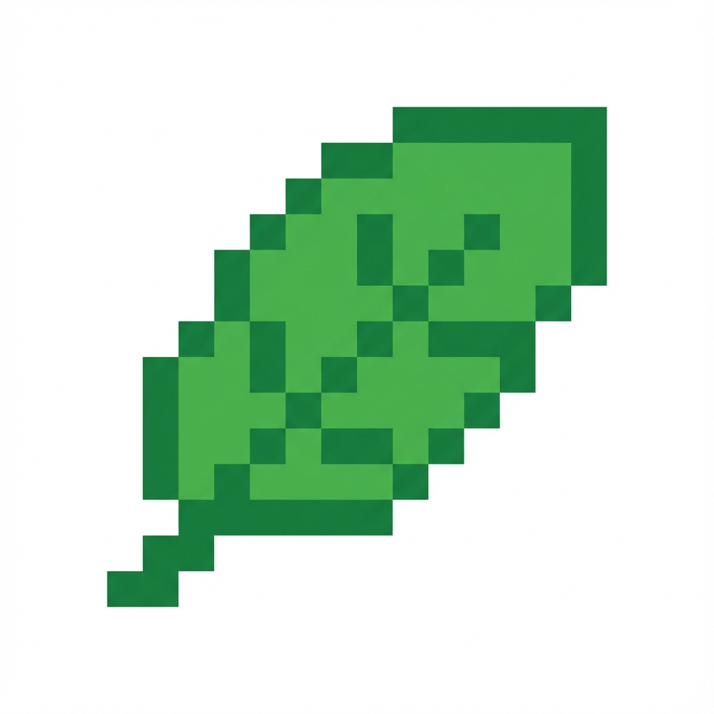</td>
          <td><b>Earth Badge</b>: Always ready to learn new things</td>
        </tr>
      </table>
    </td>
    <td width="50%" valign="top">
      <div align="center">
        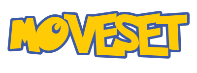
      </div>
      <div align="center">
        <h4 align="center">Languages</h4>
        
        <br><br>
        <h4 align="center">Technologies & Frameworks</h4>
        
        <br>
        
        
      </div>
    </td>
  </tr>
</table>
</div>

---

### 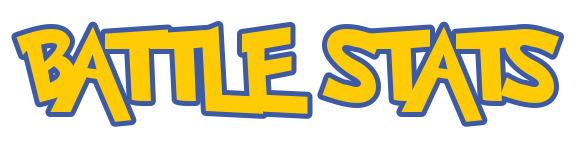
  
  
</p>

---

### 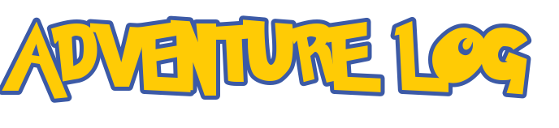
<p align="center">
  
</p>

---

### 
```bash
> connecting to link_cable...
> connection established!
> status: ready_to_collab
> target: "Software Engineer"
> current_quest: "Backend Dev + CP"
```

<div align="center">
  <a href="https://www.linkedin.com/in/ullas-das">
    
  </a>
</div>

<br>
<center>
  
  <p><i>Saving game... Don't turn off the power!</i></p>
</center>
